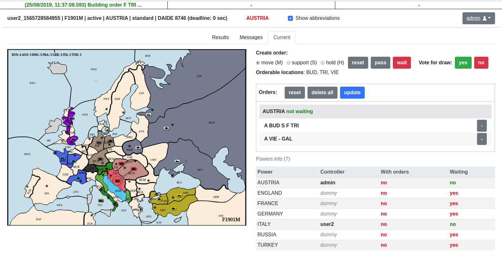

# Diplomacy: DATC-Compliant Game Engine [](https://travis-ci.org/diplomacy/diplomacy) [](https://docs.diplomacy.ai/en/latest/?badge=latest)

This project contains an open-source DATC-compliant Diplomacy game engine, a client-server architecture for network play, a web interface to play against bots and to visualize games, and a DAIDE-compatible adapter to connect DAIDE bots to the server.

<p align="center">
  
</p>

## Documentation

The complete documentation is available at [docs.diplomacy.ai](https://docs.diplomacy.ai/).

## Getting Started

### Installation

The latest version of the package can be installed with:

```python3
pip install diplomacy
```

The package is compatible with Python 3.5, 3.6, and 3.7.

### Running a game

The following script plays a game locally by submitting random valid orders until the game is completed.

```python3
import json
import random
from diplomacy import Game
from diplomacy.utils.export import to_saved_game_format

# Creating a game
# Alternatively, a map_name can be specified as an argument. e.g. Game(map_name='pure')
game = Game()
while not game.is_game_done:

    # Getting the list of possible orders for all locations
    possible_orders = game.get_all_possible_orders()

    # For each power, randomly sampling a valid order
    for power_name, power in game.powers.items():
        power_orders = [random.choice(possible_orders[loc]) for loc in game.get_orderable_locations(power_name)
                        if possible_orders[loc]]
        game.set_orders(power_name, power_orders)

    # Messages can be sent locally with game.add_message
    # e.g. game.add_message(Message(sender='FRANCE',
    #                               recipient='ENGLAND',
    #                               message='This is a message',
    #                               phase=self.get_current_phase(),
    #                               time_sent=int(time.time())))

    # Processing the game to move to the next phase
    game.process()

# Exporting the game to disk to visualize
with open('game.json', 'w') as file:
    file.write(json.dumps(to_saved_game_format(game)))
```

## Web interface

It is also possible to install a web interface in React to play against bots and/or other humans and to visualize games.

The web interface can be installed with:

```bash
# Install NVM
curl -o- https://raw.githubusercontent.com/nvm-sh/nvm/v0.34.0/install.sh | bash

# Clone repo
git clone https://github.com/diplomacy/diplomacy.git

# Install package locally
# You may want to install it in a conda or virtualenv environment
cd diplomacy/
pip install -r requirements_dev.txt

# Build node modules
cd diplomacy/web
npm install .
npm install . --only=dev

# In a terminal window or tab - Launch React server
npm start

# In another terminal window or tab - Launch diplomacy server
python -m diplomacy.server.run
```

The web interface will be accessible at http://localhost:3000.

To login, users can use admin/password or username/password. Additional users can be created by logging in with a username that does not exist in the database.



### Visualizing a game

It is possible to visualize a game by using the "Load a game from disk" menu on the top-right corner of the web interface.


## Network Game

It is possible to join a game remotely over a network using websockets. The script below plays a game over a network.

Note. The server must be started with `python -m diplomacy.server.run` for the script to work.

```python3
import asyncio
import random
from diplomacy.client.connection import connect
from diplomacy.utils import exceptions

POWERS = ['AUSTRIA', 'ENGLAND', 'FRANCE', 'GERMANY', 'ITALY', 'RUSSIA', 'TURKEY']

async def create_game(game_id, hostname='localhost', port=8432):
    """ Creates a game on the server """
    connection = await connect(hostname, port)
    channel = await connection.authenticate('random_user', 'password')
    await channel.create_game(game_id=game_id, rules={'REAL_TIME', 'NO_DEADLINE', 'POWER_CHOICE'})

async def play(game_id, power_name, hostname='localhost', port=8432):
    """ Play as the specified power """
    connection = await connect(hostname, port)
    channel = await connection.authenticate('user_' + power_name, 'password')

    # Waiting for the game, then joining it
    while not (await channel.list_games(game_id=game_id)):
        await asyncio.sleep(1.)
    game = await channel.join_game(game_id=game_id, power_name=power_name)

    # Playing game
    while not game.is_game_done:
        current_phase = game.get_current_phase()

        # Submitting orders
        if game.get_orderable_locations(power_name):
            possible_orders = game.get_all_possible_orders()
            orders = [random.choice(possible_orders[loc]) for loc in game.get_orderable_locations(power_name)
                      if possible_orders[loc]]
            print('[%s/%s] - Submitted: %s' % (power_name, game.get_current_phase(), orders))
            await game.set_orders(power_name=power_name, orders=orders, wait=False)

        # Messages can be sent with game.send_message
        # await game.send_game_message(message=game.new_power_message('FRANCE', 'This is the message'))

        # Waiting for game to be processed
        while current_phase == game.get_current_phase():
            await asyncio.sleep(0.1)

    # A local copy of the game can be saved with to_saved_game_format
    # To download a copy of the game with messages from all powers, you need to export the game as an admin
    # by logging in as 'admin' / 'password'

async def launch(game_id):
    """ Creates and plays a network game """
    await create_game(game_id)
    await asyncio.gather(*[play(game_id, power_name) for power_name in POWERS])

if __name__ == '__main__':
    asyncio.run(launch(game_id=str(random.randint(1, 1000))))

```
## License

This project is licensed under the APGLv3 License - see the [LICENSE](LICENSE) file for details
